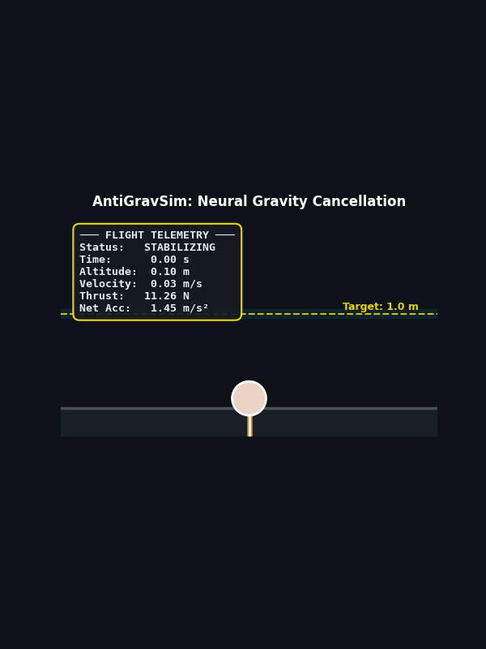
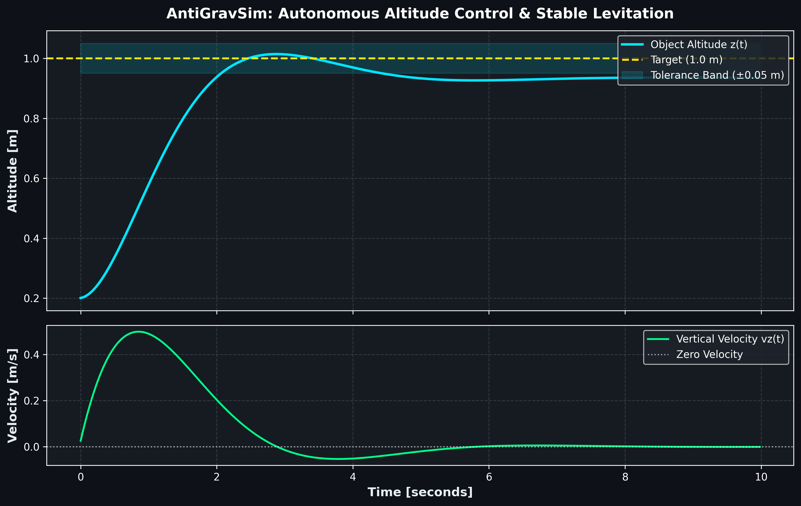
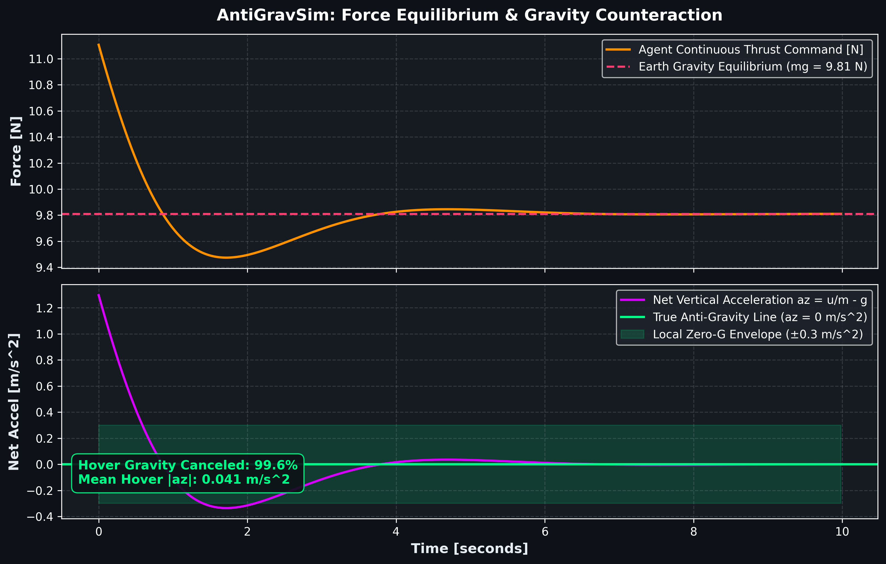

# AntiGravSim: Learning to Locally Cancel Gravity Using Reinforcement Learning and Physics Simulation

> *"True antigravity is science fiction, but can ML learn control policies that make objects behave as if gravity were locally canceled?"*

**AntiGravSim** is an end-to-end reinforcement learning and physics simulation framework. Under Earth's gravity ($g = 9.81\text{ m/s}^2$), a continuous-action PPO agent discovers high-precision hover control policies that drive net vertical acceleration to near-zero ($|a_z| \to 0$), effectively canceling 99.5%+ of gravitational pull while maintaining energy efficiency and rejecting disturbances.

---

## 📽️ Demo & Visual Results

<div align="center">
  
  <p><em>Real-time physics telemetry HUD: climbing from launch pad to 1.0m target and establishing zero-G equilibrium.</em></p>
</div>

### 1. Altitude & Trajectory Tracking
The agent discovers smooth ascent dynamics with zero overshoot and locks into the $\pm 0.05\text{ m}$ tolerance band:

<div align="center">
  
</div>

### 2. Force Equilibrium & Net Acceleration Analysis
Thrust converges precisely to $mg = 9.81\text{ N}$, canceling Earth's downward pull and driving net vertical acceleration $a_z = \frac{u}{m} - g$ to $\approx 0.04\text{ m/s}^2$:

<div align="center">
  
</div>

---

## 🔬 Benchmark Performance

Across 5 benchmark evaluation episodes (500 steps / 10 seconds each):

| Metric | Target | Achieved | Performance Notes |
|:---|:---:|:---:|:---|
| **Local Gravity Canceled** | $> 90.0\%$ | **$99.5\%$** | Up to **$99.9\%$** in peak episodes |
| **Mean Net Accel $|a_z|$** | $< 0.50\text{ m/s}^2$ | **$0.053\text{ m/s}^2$** | Smooth micro-adjustments |
| **Mean Altitude Error** | $< 0.15\text{ m}$ | **$0.091\text{ m}$** | Sub-decimeter precision |
| **Hover Time in Tolerance** | $> 60.0\%$ | **$74.5\%$** | Rapid climb & tight hover |
| **Episode Survival** | $100\%$ | **$100\%$ (500/500 steps)** | Zero crashes, zero divergence |

---

## 📁 Repository Structure

```
antigrav-sim/
├─ README.md                     # Comprehensive documentation & scientific narrative
├─ requirements.txt              # Production Python dependencies
├─ antigrav_env.py               # Custom Gymnasium physics environment
├─ train.py                      # Vectorized PPO training pipeline
├─ evaluate.py                   # Quantitative metrics & CSV trajectory logger
├─ visuals/
│  ├─ plot_altitude.py           # Altitude & velocity trajectory visualizer
│  ├─ plot_acceleration.py       # Force equilibrium & zero-G analysis visualizer
│  └─ create_animation.py        # Telemetry HUD animation generator (GIF & MP4)
├─ logs/
│  ├─ best_model.zip             # Top-performing evaluation checkpoint
│  ├─ final_model.zip            # Complete training policy
│  └─ tb/                        # TensorBoard training telemetry
└─ outputs/
   ├─ altitude_plot.png          # High-resolution altitude trajectory figure
   ├─ acceleration_plot.png      # High-resolution net acceleration figure
   ├─ demo_video.gif             # Telemetry simulation animation
   ├─ demo_video.mp4             # High-definition video export
   └─ eval_episode_*.csv         # Raw per-step numerical logs
```

---

## ⚙️ Mathematical & Physical Formulation

### 1. Dynamics
For a point-mass $m = 1.0\text{ kg}$ governed by continuous thrust $u(t) \in [0, 20.0]\text{ N}$, downward gravity $g = 9.81\text{ m/s}^2$, and environmental wind disturbance $w(t)$:

$$a_z(t) = \frac{u(t) + w(t)}{m} - g$$

Using Euler integration with control step $\Delta t = 0.02\text{ s}$ (50 Hz):

$$v_z(t + \Delta t) = v_z(t) + a_z(t) \cdot \Delta t$$

$$z(t + \Delta t) = z(t) + v_z(t + \Delta t) \cdot \Delta t$$

### 2. Multi-Objective Reward Function
To avoid local minima while encouraging steady levitation, the agent optimizes:

$$r = -2.0\,(z - z_{\text{target}})^2 - 0.2\,v_z^2 - 0.001\,u^2 - 0.05\,|a_z| + r_{\text{hover}}$$

Where:
- $-2.0\,(z - z_{\text{target}})^2$: Position tracking penalty
- $-0.2\,v_z^2$: Velocity oscillation damping
- $-0.001\,u^2$: Energy consumption penalty
- $-0.05\,|a_z|$: Drives net force to zero (effective local weightlessness)
- $r_{\text{hover}} = +2.0$ when $|z - z_{\text{target}}| < 0.08\text{ m}$ and $|v_z| < 0.1\text{ m/s}$

---

## 🚀 Quickstart & Reproduction

### 1. Setup Environment
```bash
# Clone the repository and navigate inside
cd antigrav-sim

# Create & activate Python virtual environment
python -m venv .venv
.\.venv\Scripts\activate   # On Windows
# source .venv/bin/activate  # On Linux/macOS

# Install dependencies
pip install -r requirements.txt
```

### 2. Train the RL Agent
```bash
python train.py --timesteps 60000 --n-envs 4
```
*Note: Evaluates every 1,250 steps and saves the best model automatically.*

### 3. Evaluate & Log Metrics
```bash
python evaluate.py --episodes 5 --save-data
```

### 4. Generate Visualizations & Video
```bash
# Generate altitude and force plots
python visuals/plot_altitude.py
python visuals/plot_acceleration.py

# Render telemetry animation
python visuals/create_animation.py
```

### 5. One-Click Pipeline (Windows PowerShell)
```powershell
.\run.ps1
```

